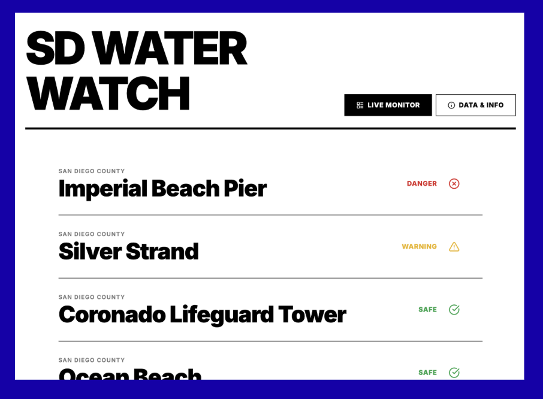

# SD Water Watch

A minimalist, high-contrast water quality tracker for San Diego beaches. This application aggregates data from the San Diego County Department of Environmental Health and Quality (DEHQ) and uses Google Gemini AI to analyze safety trends.



## Features

*   **Live Monitoring**: Real-time status (Safe/Warning/Danger) for key San Diego beaches.
*   **AI Analysis**: Generates natural language safety summaries using Google Gemini 2.5 Flash.
*   **Trend Visualization**: 30-day historical data charts with dynamic safety thresholds.
*   **Robust Architecture**: 
    *   Primary Data Source: San Diego County ArcGIS API.
    *   Fallback System: Includes local dataset to prevent crashes during API outages.
*   **Responsive Design**: "Swiss Style" UI optimized for mobile and desktop.

## Tech Stack

*   **Framework**: React 18 + Vite
*   **Styling**: Tailwind CSS
*   **Charts**: Recharts
*   **AI Integration**: Google GenAI SDK (`@google/genai`)
*   **Icons**: Lucide React

## Setup & Development

1.  **Install Dependencies**
    ```bash
    npm install
    ```

2.  **Set Environment Variables**
    Ensure your API key is available in your environment (e.g., `.env` or system variables) as `API_KEY`.

3.  **Run Locally**
    ```bash
    npm run dev
    ```

4.  **Production Preview**
    ```bash
    npm run build
    npm run preview
    ```

## Deployment (Cloud Run)

The project is configured for Google Cloud Run.

1.  **Build**
    ```bash
    npm run build
    ```
    
2.  **Deploy**
    Ensure the container binds to `0.0.0.0` and port `8080`.
    
    *`package.json` start script:*
    ```json
    "start": "vite preview --host 0.0.0.0 --port 8080"
    ```

## Data Sources

*   **Water Quality**: [San Diego County Beach Water Quality (sdbeachinfo.com)](http://www.sdbeachinfo.com/)
*   **Pollutant Standards**: California Ocean Plan (Enterococcus MPN/100ml limits).
